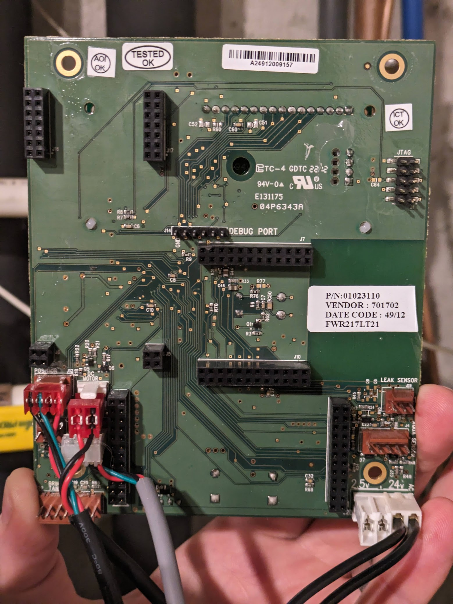
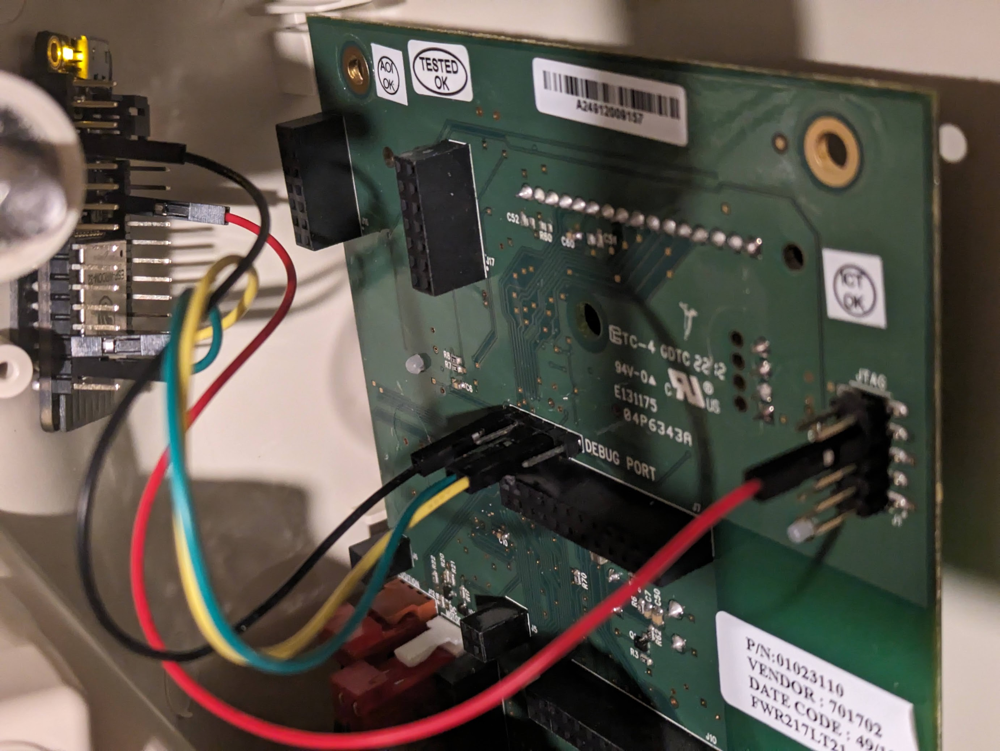

# cullAssistant
An esphome configuration that receives messages via serial from Culligan water softeners and sends `Gallons` (gal), `Gallons Per Minute` (gal/min), and `Gallons to Recharge` (gal) to Home Assistant. `Gallons` can be used as a `Water Source` in the `Energy Dashboard`

Using this [manual](https://adms.fnal.gov/vacuum/manuals/diwater/Manuals/1b.%20GBE%20Industrial%20Communications%20(RS232%20RS485%20Modbud%20Profybus)%2001021512_C_w.pdf) I was able to determine that (some?) Culligan water softeners have a debug port that send a simple water usage message every ~60 seconds. 

```
CULL,00420429,000000.0,1,00000902,0x0000,1,0315242140\n\r
```

The second field is the total number of gallons that the water softener has measured, the third field is the current flow rate in gallons per minute and the fifth is the number of gallons remaining until the next recharge. There are other status, error and timestamp fields that I have not looked into. 

The back of my controller board pictured below with the `DEBUG PORT`. From left to right Pin 1 is Ground (marked), Pin 4 is Transmit and Pin 5 is Receive. 



I was able to find 5v from the JTAG port, I can't say that I recommend this as it resets the controller every time I plug the esp32 board in.



You will need to edit [cullAssistant.yaml](./cullAssistant.yaml) to ensure proper board and tx/rx pin configuration. 

## Thank you
Thank you to the Home Assistant and esphome developers, a specific thank you to [Samuel Sieb](https://github.com/ssieb/) for the `serial_csv` component and the help in [discord](https://discord.gg/esphome)